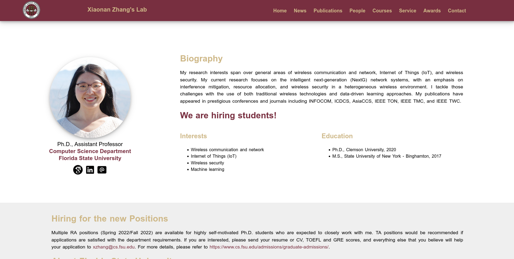
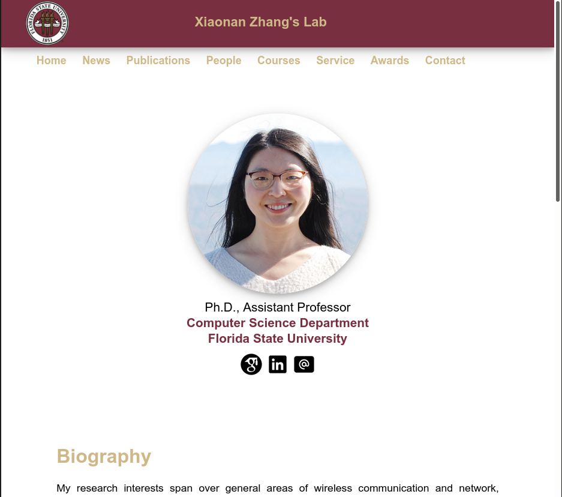
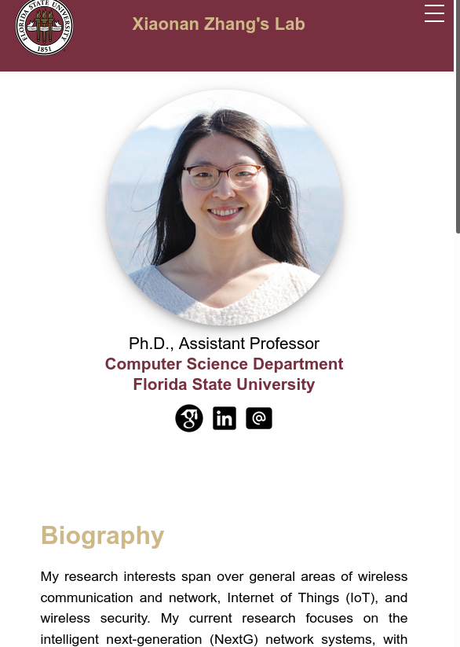
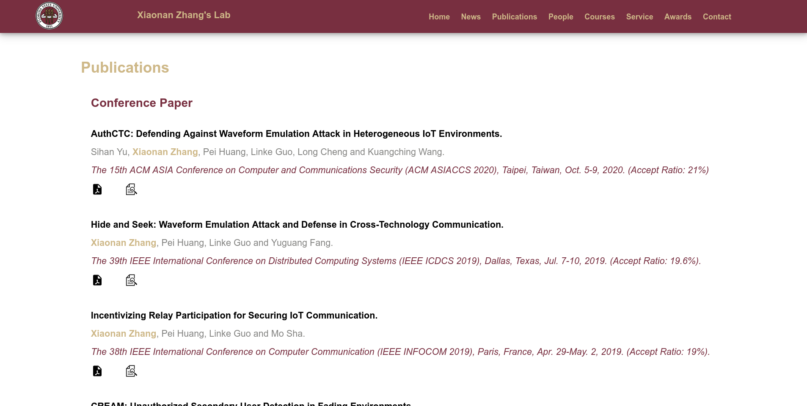
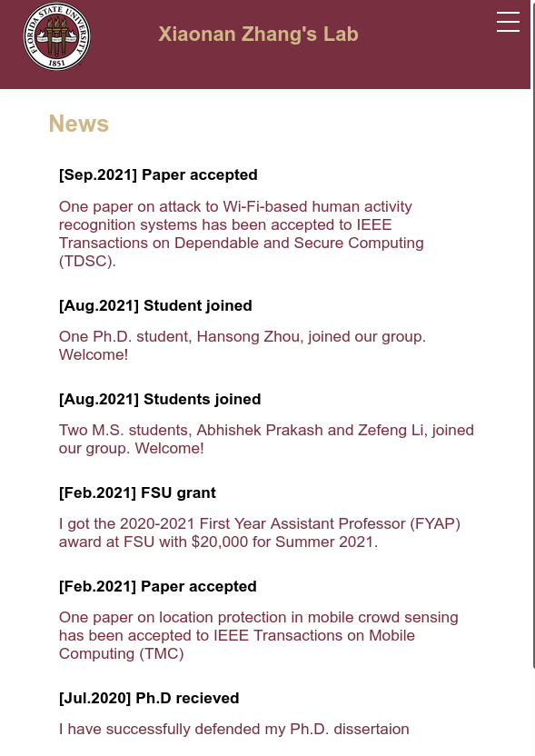
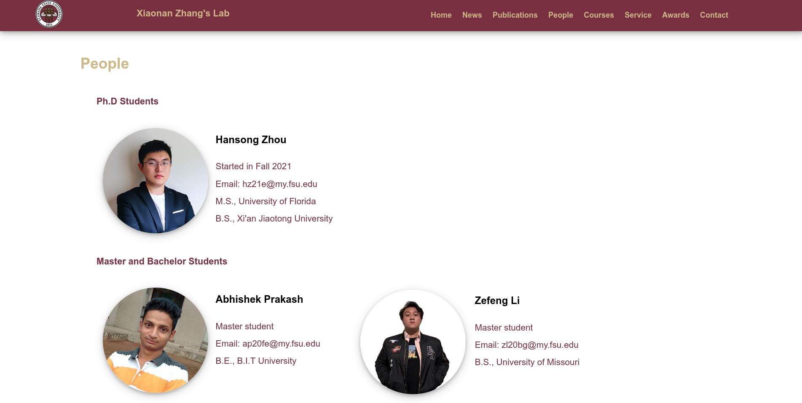
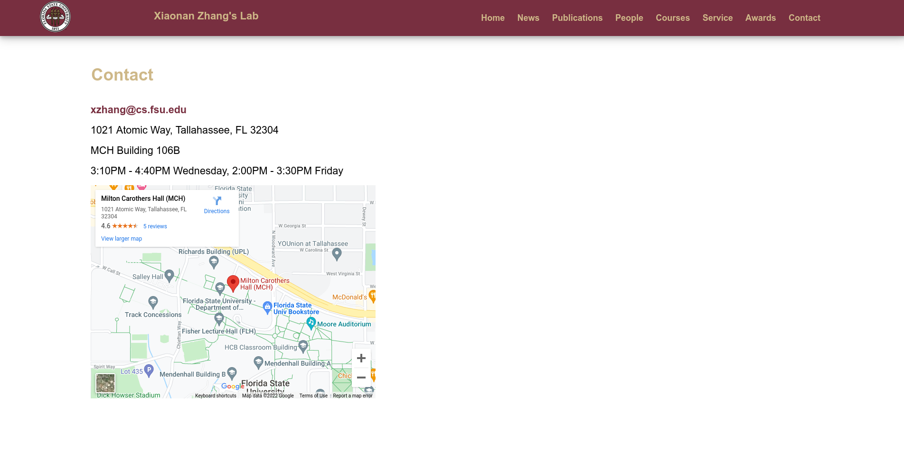
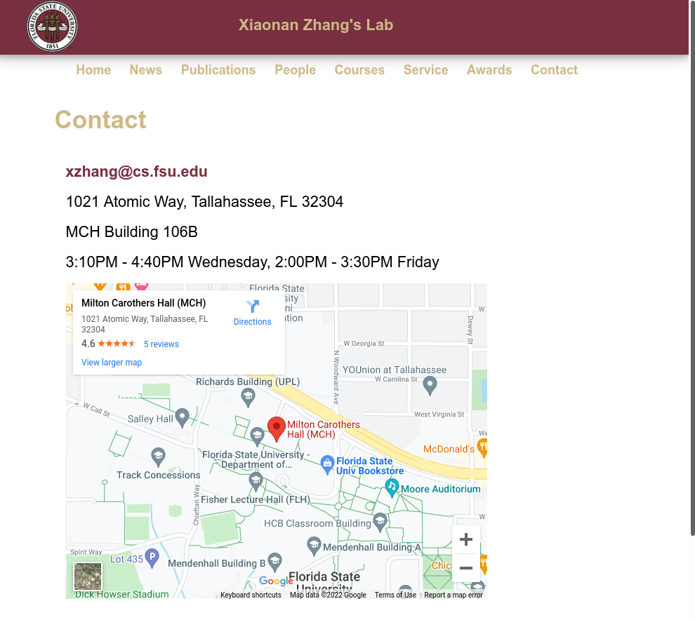
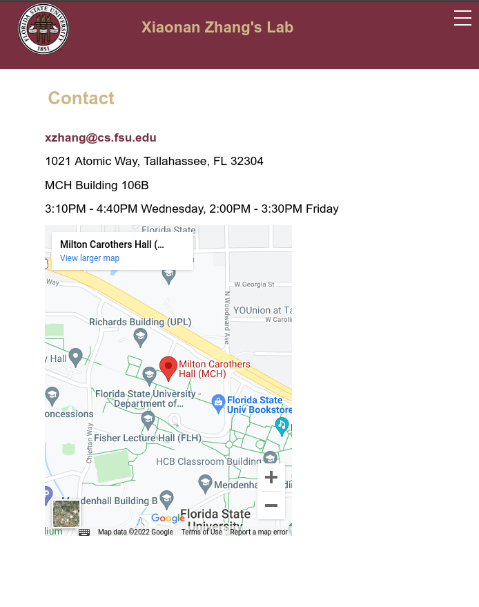

## Project Description - 

Static Academic website made to showcase the profile and works, made using HTML, CSS, Media Query (for the responsive optimization for mobile, tablet and different size devices). The website is consist of 8 pages that shows the different aspects from main page to contact page. Google Maps API is used to display the map. CSS flex boxes are also used for more size responsive optmizatrions.

### Pages 

### Main Page 

### Conference Page  

### People Page 

### Contact Page - 

